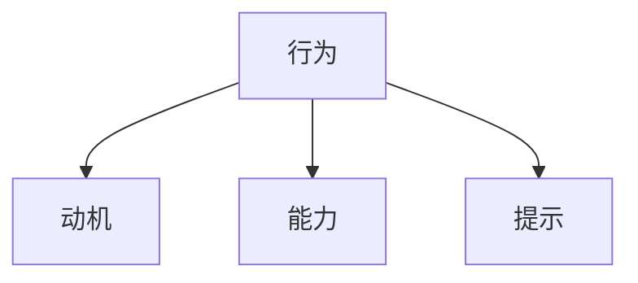
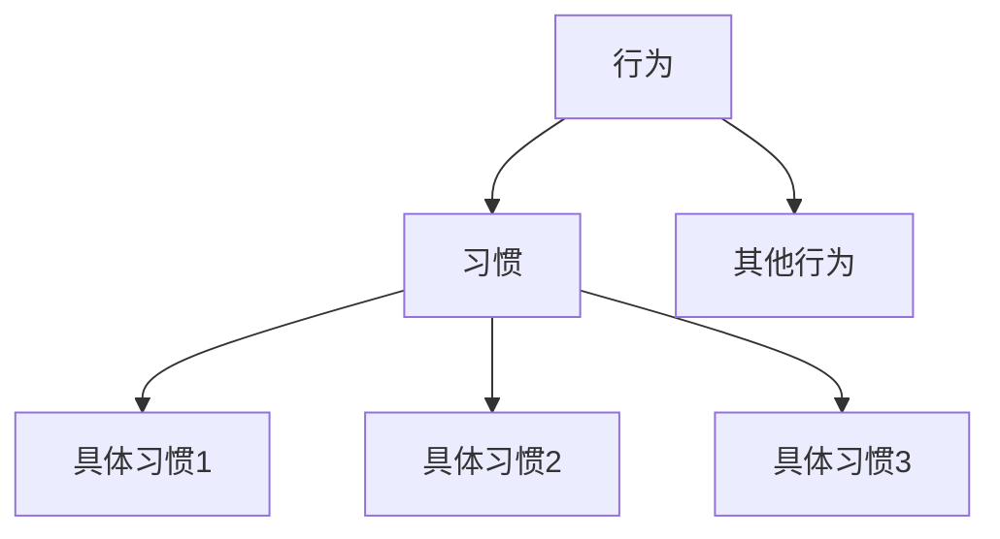
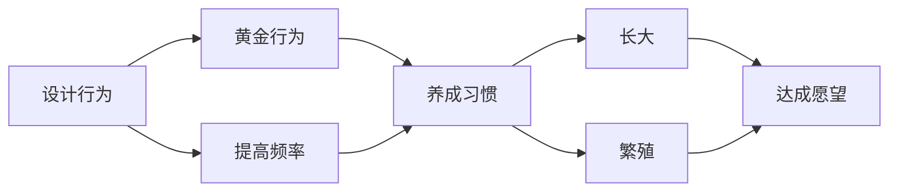
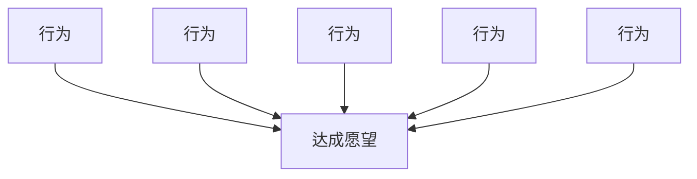
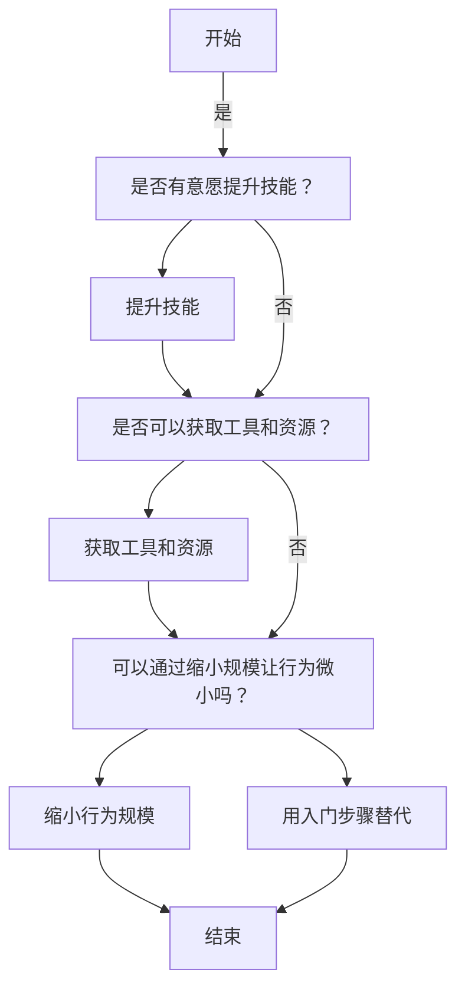

# 福格行为模型

## 简要总结

1. B=MAP
2. 动机=>若干行为列表=>黄金行为
3. 能力：提升技能，微小行为
4. 提示：固定锚点（状态和行为达成时就一定做某事），即提升做事概率
5. 庆祝：即时且有强度

## 定义

> 行为(Behavior) = 动机（Motivation） + 能力(Ability) + 提示(Prompt)

**习惯是行为的子集**。习惯，只是下意识的、容易自然而然发生的行为。两者没有本质区别。

**通过拆解行为如何发生，努力提高黄金行为的发生频率；通过提高行为发生的频率，养成良好的习惯；通过养成良好的习惯（或替换坏习惯），达成愿望，完成转变。**

## 行为：最后考虑动机

**最后考虑动机**不是因为动机不重要，而是**动机具有难以干预、复杂、波动的性质**。很多动机随着时间会逐渐消逝。

**行为，是达成目标的直接手段，行为是可以立即实施的，而目标却不行。**因此在具有动机时，需要将重心从愿望转移到行为，建立起从愿望到行为的映射关系。这和组织管理中的OKR方法比较类似，先树立有挑战性的目标（Object），再匹配若干关键结果（Key Results）。只要关键结果完成了，目标自然达成。

### 行为集群方法：快速从愿望衍生出若干行为

拿出一张白纸，在正中间**写下希望达成的愿望**（更有仪式感一点，可以在文字外面画朵云）。然后，围绕着这个愿望，想想达成了哪些行为，就可以促成愿望的实现。**在此阶段，想出来的行为数量比质量（相关性）更重要。**可以设个倒计时，比如10分钟内，让自己尽量写出最多的行为。

举个例子，我的愿望是坚持读书。以下是我在几分钟内想出来的可能行为：

- 每晚10点半之后开始看书，直到睡觉
- 早上到办公室后先看半小时书
- 为自己挑选一些简短有趣的书籍
- 周末有时间逛逛书店
- 把SWITCH游戏机收起来
- 及时写读书笔记
- ……

记住，此阶段最重要的是挥舞魔法棒，写下尽可能多的行为。

**将排在优先级列表顶部的行为称为“黄金行为”，它有三个特征：**

1. **有动力去完成。**
2. **有能力做到**
3. **对达成愿望有帮助**

**黄金行为，就像狙击枪上的瞄准镜，清晰了实际可操作的目标。**后续所有设计，包括能力和提示，都要围绕着黄金行为进行。

## 能力：提升和缩小范围

从五个方面着手分析，分别是：**时间、资金、体力、脑力和日程**。

改变的三种方法，分别是：

1. **提升技能**
2. **获取工具和资源**
3. **让行为变得微小**

## 提示：关键但隐蔽

**动机能直接感受到，能力可以客观评估，而提示往往隐蔽不见。**提示却是行为发生的决定性要素。没有提示，行为就不会发生——动机再高、能力再强也不行。即提示能大幅增强做这件事的概率。

### **提示的不同类型**

福格博士将提示分为三类，而其中有一类对养成习惯非常有帮助。

**第一种提示，是人物提示。**比如，突然见到某人，想起要跟他说一件事。

**第二种提示，是情境提示。**比如，听到某首歌，就会想起某件事。各种日程表、待办事项清单等，也属于这种类型。

**第三种提示，是行为提示。**完成某个行为时，就会想起某件事。

福格博士**提倡用行为作为提示**，即**将已经形成习惯的行为作为提示，以此来培养新的习惯**。作为提示的行为，他称之为**“锚点”**。

> 现在市面上大部分的产品，都比较注重情境提示（app图标上的小红点）。但随着大家都往情境提示上扎堆，其效果却越来越弱。这就跟囚徒困境一样，竞品之间陷入越发低效的竞争。也许，对于未来的产品设计方向来讲，需要更加注重行为提示。比如，深入的观察和调研用户，他们往往是在什么时候打开自家的app。

### 善用锚点，让行为立刻发生

> 有点类似于米家的自动化判定模式，首先需要一个必须满足的条件，然后还要处于必要的状态之中，就会执行相应的操作。

**第一步：确定锚点。**

在确定锚点时，有一个原则需要注意：锚点最好是生活中一定会发生的事情，比如睡觉、起床、吃饭、上厕所、刷牙等。只有保证锚点一定会发生，才不会错过想要完成的行为。

**第二步：用试验将锚点与黄金行为联系起来。**

为行为匹配锚点，就像拼拼图，需要找到最契合那一个。此时，可以分别从以下几个方面考虑：**地点，频率，主题或目的**。

如果目标行为是跑步，那作为锚点的行为最好是在家里，在公司就不合适。这是地点的考虑。

如果目标行为是每日阅读，那作为锚点的行为最好是吃完晚饭，洗完衣服可能就不合适。晚饭是每天都要吃的，而衣服不一定每天都洗。这是频率的考虑。

总结一下，还是回到之前提到过的：好的锚点，必须自然，即在地点、频率和主题上相匹配。

另外，尝试将锚点与行为联系起来，是个不断试错的过程，不要寄希望于一步到位。这是心理上的必要准备。

**第三步：利用“最后动作”优化锚点。**

锚点本身，也有优劣之分。好的锚点，一定是具体的。最后一步，就是对锚点进行优化，使之更加具体。在此，福格博士提出了“最后动作”的概念。

怎么理解？比如，“上完厕所”就是一个相对模糊的锚点，而“按下冲洗马桶按钮”就更明确。并且，冲马桶正是上完厕所的最后一个动作。同理，相比“喝完水”，“放下水杯”也是一个更加明确的锚点。

## 庆祝：情绪和奖励

**行为设计，其本质就是情绪设计。**

1. **庆祝必须及时**。**奖励的最佳时机要么是在行为过程中，要么是在行为结束之后的那一刻**。激励也许可以在短时间内提高重复行为的动机，但它无法融入大脑，对养成习惯的效果低于奖励。

2. **庆祝必须有强度**——即真切地感受到庆祝带来的积极情绪。正向的情绪有很多种，开心、快乐、充实等等。但福格博士在长期教学中发现，**创造成功感觉是其中最有效的一种**。他甚至专门找了一个与众不同的词来描述这种感受：**发光（Shine）**。当你感受到成功时，就好像自己在发光。
