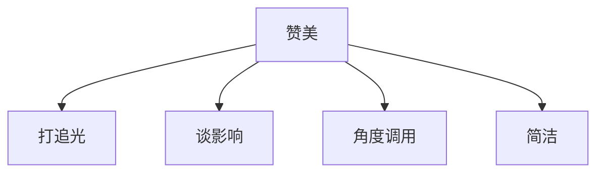

# 赞美

1. 打追光

**人追求的是被看见优点，首先是对方和其所在群体之间的差异：**

> 领导下基层，调查工作

**人喜欢被看见努力，打光打在行为的努力上而不是禀赋上：**

> 考上好大学是努力刷题，工资高是努力工作，情商高是有勇气去做大量的实践，去和很多人去接触。

2. 谈影响

我赞美是因为你的优秀**深深地影响了我。**表述其优点嵌入了我的生活，最大化认同其价值。

> 考虑问题的方式变化，从一个项目的开始结束，其影响范围、优缺点来考虑让我工作得心应手。
>
> （领导）您指出的问题挨个排查解决了一遍，产生了好的效果。
>
> 一路走来，对后辈传授的心得？

3. 角度调用

> 吃什么不重要，重要的是和谁吃。

4. 简洁

赞美的表达要简洁，不要给别人造成负担。